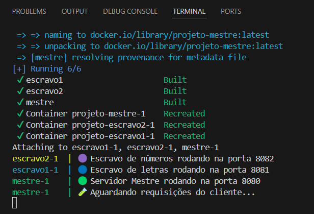
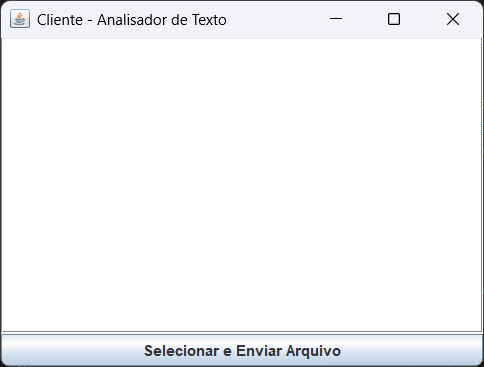
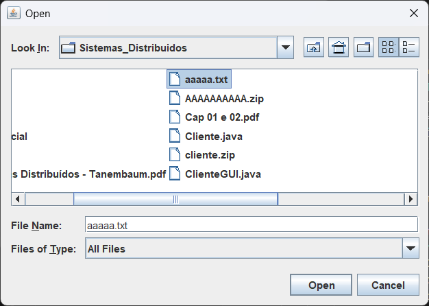
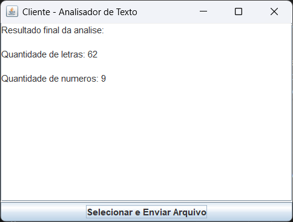
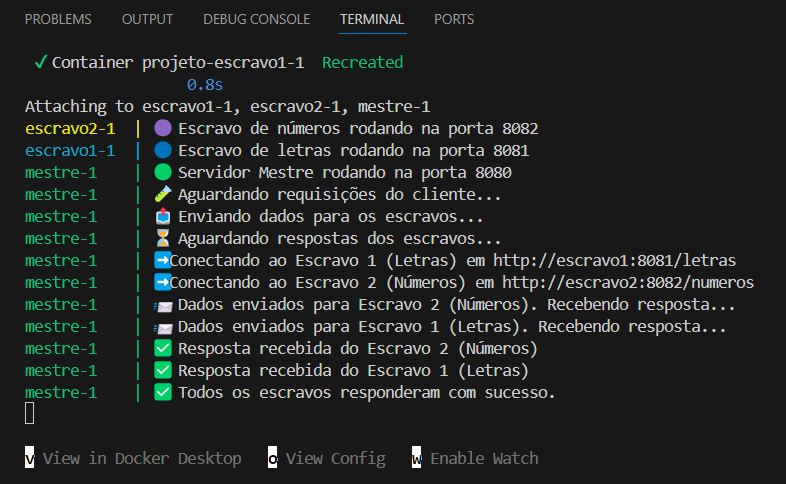

# SD-Trabalho04

## **Descrição do Projeto de Sistemas Distribuídos – Middleware com Java e Docker**

Este projeto teve como objetivo a construção de um sistema distribuído, utilizando a linguagem Java, com comunicação entre componentes realizada por meio de requisições HTTP. A arquitetura adotada foi do tipo mestre-escravo, com os componentes principais sendo o **Cliente (com interface gráfica)**, o **Servidor Mestre** e dois **Servidores Escravos**. O sistema foi executado em containers Docker, simulando um ambiente distribuído real.

O funcionamento geral do sistema consiste em: o cliente envia um arquivo `.txt` contendo letras e números para o servidor Mestre. Este, por sua vez, utiliza duas **threads** para dividir a tarefa entre dois servidores Escravos, um responsável por contar letras e outro por contar números. Os resultados retornados são então combinados pelo Mestre e enviados de volta ao cliente.

### **Resumo dos Códigos Implementados**

- **Cliente (ClienteGUI.java):**  
  Aplicação com interface gráfica (GUI), construída com Swing, que permite ao usuário selecionar um arquivo `.txt`. Após a seleção, o conteúdo do arquivo é enviado via requisição HTTP ao servidor Mestre. A resposta, com a quantidade de letras e números, é exibida na própria janela da aplicação.

- **Servidor Mestre (Mestre.java):**  
  Componente central do sistema, responsável por receber o conteúdo enviado pelo cliente e coordenar o processamento paralelo. Ele cria duas threads que se comunicam com os Escravos. Cada thread envia o conteúdo para um escravo diferente e aguarda a resposta. Ao final, o Mestre combina os resultados e responde ao cliente com o total de letras e números encontrados.

- **Escravo 1 (Escravo1.java):**  
  Responsável por contar a quantidade de letras no texto recebido. Ele expõe um endpoint `/letras` e responde ao Mestre com o resultado do processamento.

- **Escravo 2 (Escravo2.java):**  
  Responsável por contar a quantidade de números no texto recebido. Expõe um endpoint `/numeros` e envia a resposta ao Mestre.

Todos esses componentes foram empacotados individualmente em containers Docker e executados em conjunto usando `docker-compose`.

---

## **Passo a Passo da Execução do Projeto**

Para executar o projeto, o primeiro passo foi compilar e executar o servidor Mestre juntamente com os Escravos utilizando o comando:

```bash
docker-compose up --build
```

Esse comando foi executado na máquina principal, onde o Mestre e os dois Escravos foram inicializados em containers separados. O servidor Mestre ficou exposto na porta 8080, aguardando as requisições do cliente. Os Escravos, também em containers, foram configurados para responder nas portas 8081 e 8082, respectivamente.



Em seguida, em outro notebook (ou até mesmo na mesma máquina, em outro terminal), o programa do cliente foi executado normalmente ou pelo terminal com os comandos:

```bash
javac ClienteGUI.java
java ClienteGUI
```

Ao ser iniciado, o cliente exibe uma janela gráfica com o botão **"Selecionar e Enviar Arquivo"**. 



Quando o usuário clica neste botão, é aberta uma janela para seleção de um arquivo `.txt`.



Após selecionar o arquivo, o conteúdo é automaticamente enviado ao Mestre. O resultado da análise (quantidade de letras e números) aparece na janela do cliente. 



É importante destacar que, no código do cliente, ao ser executado em uma maquina diferente da do mestre, é necessário que as duas estejam na mesma rede, além de que o endereço `localhost` usado na URL de envio precisa ser substituído pelo **endereço IPv4 da Rede sem Fio Wi-Fi da máquina onde o Mestre está rodando**. Esse IP pode ser encontrado executando no terminal do Windows o comando:

```bash
ipconfig
```

Com essa configuração feita corretamente, o cliente se comunica com o servidor Mestre, que então distribui a tarefa entre os dois Escravos. O resultado final, contendo a contagem de letras e de números no arquivo selecionado, é exibido diretamente na janela do cliente. A imagem a seguir mostra através do terminal que o mestre foi executado as comunicações feitas nesse processo entre as partes. 



